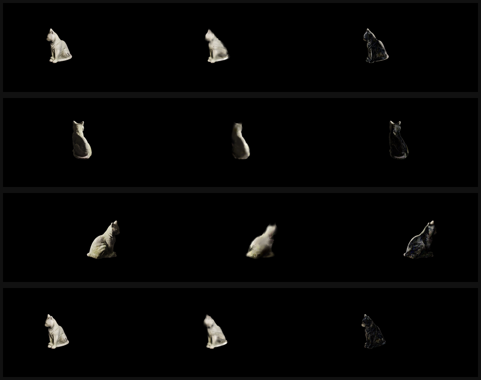
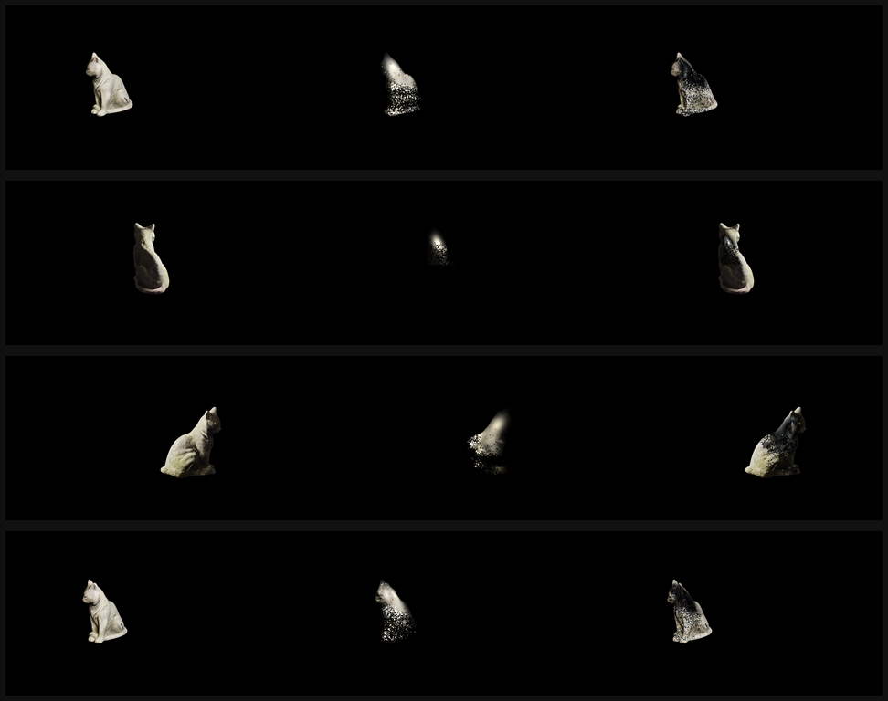
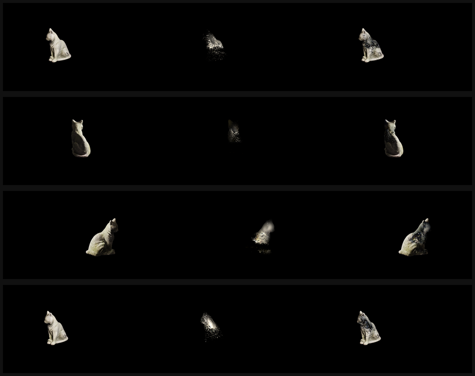
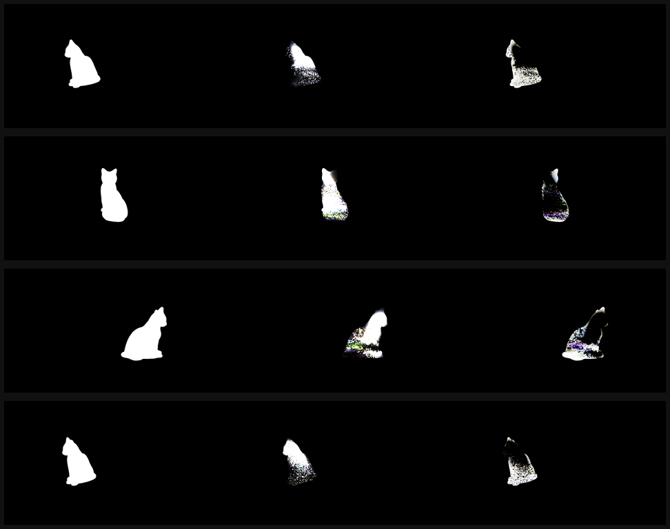
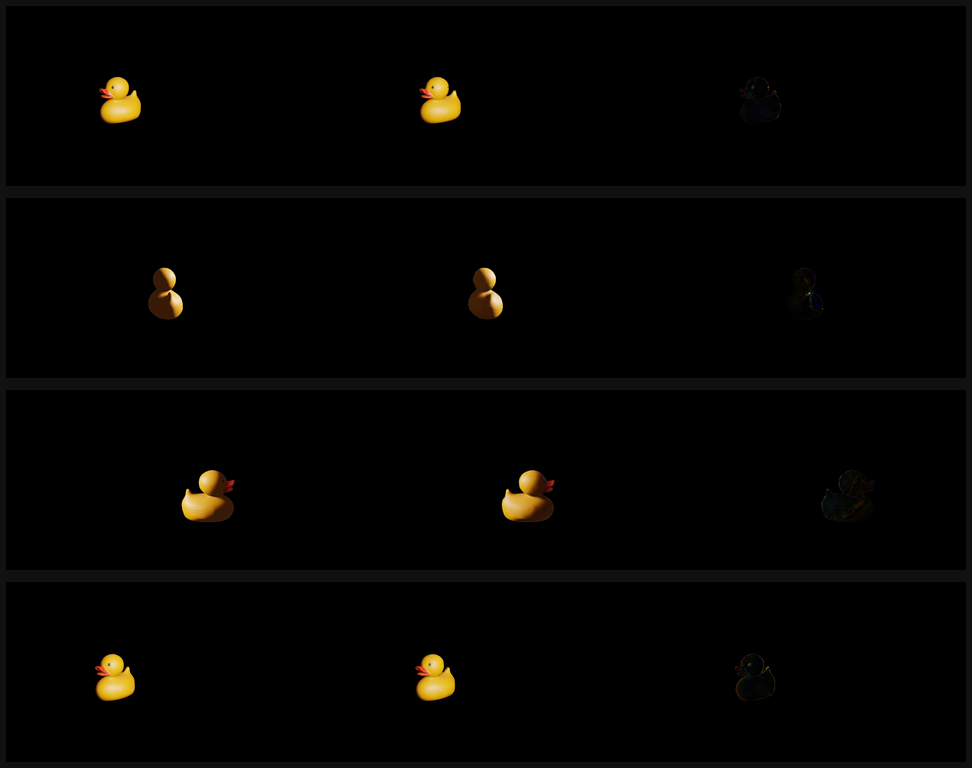
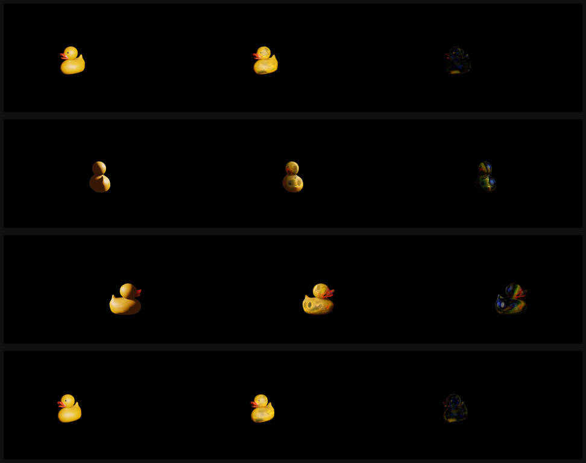
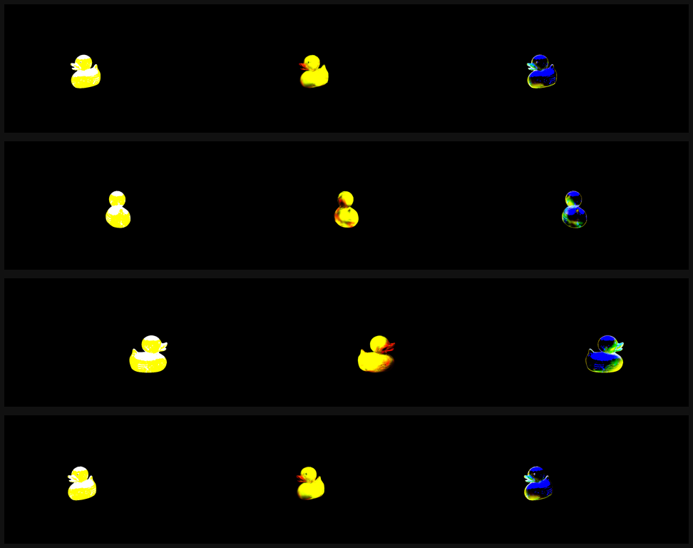

# LH-data LumiMotion 原版两阶段训练结果

执行日期：2026-06-22 至 2026-06-23

## 1. 实验目标

本实验在两个 120 帧固定相机场景上完整运行 LumiMotion 原版两阶段流程：

- `cat`
- `rubber_duck_toy_dataset`

Stage 1 使用 `render_mode=original` 学习 Gaussian 几何、外观和时间 deformation；Stage 2 从 Stage 1 checkpoint 继续学习 albedo、roughness、opacity、deformation color head 和全局 `EnvLight`。本实验不使用新增的 `photometric_lambertian` 模式。

详细数据转换和复现命令见 `DOC/LH-data-original-training.md`。

## 2. 数据与评估协议

每个场景共 120 帧，原始分辨率为 `1280x720`，训练使用 `--resolution 2`，即 `640x360`。

划分方式：按原始顺序每第 8 帧留作测试集。

| 集合 | 帧数 | 帧编号 |
| --- | ---: | --- |
| train | 105 | 除测试帧外的其余帧 |
| test | 15 | 8, 16, 24, ..., 120 |

所有帧使用同一固定相机，因此这里的 test 是同视角时间留帧，不是 novel-view 测试。RGB 图像的原始 alpha 全为 255；实际 mask 由恒定背景色生成，转换后图像使用黑背景 RGBA。

统一评估对全部 15 个 test 帧的 RGB 重建和 Stage 2 albedo 分别计算：

- L1，越低越好。
- PSNR，越高越好。
- SSIM，越高越好。
- LPIPS(VGG)，越低越好。
- MS-SSIM，越高越好。
- LPIPS(Alex)，越低越好。

Stage 1 与 Stage 2 使用相同 test 帧、相同分辨率和相同 alpha mask。每张 comparison 图从左到右为 `GT | Render | Absolute Error`。Albedo 按仓库原评估约定转到 linear RGB，并在全部测试前景像素上使用 per-channel median 做尺度对齐；最终 JSON 同时记录尺度、平均指标和逐帧指标。

## 3. 运行环境

| 项目 | 值 |
| --- | --- |
| 仓库 | `/home/han.li/reproduce/LumiMotion` |
| Git 分支 | `feature/photometric-lambertian-v1` |
| 训练前基线 commit | `263119e` |
| Conda 环境 | `lumimotion-cu129` |
| Python | 3.10.20 |
| PyTorch / torchvision | 2.11.0+cu128 / 0.26.0+cu128 |
| CUDA runtime / cuDNN | 12.8 / 9.19.0 |
| GPU | NVIDIA RTX PRO 6000 Blackwell Max-Q Workstation Edition |
| Stage 1 iteration | 35,000 |
| Stage 2 起止 iteration | 35,000 -> 55,000 |

## 4. 稳定性处理

初次使用默认 `opacity_reset_interval=3000` 时，两个正式 Stage 1 任务都在 iteration 3100 失败。原因是 iteration 3000 opacity reset 后，下一次 densify/prune 将 Gaussian 数量裁为 0，rasterizer backward 随后收到空 SH tensor。

最终正式 Stage 1 使用：

```text
opacity_reset_interval = 100000
min_opacity             = 0.005
```

这不会改变原版 renderer、deformation network 或 loss 结构。3300 iteration 稳定性测试先验证禁用 opacity reset 后可以跨过原失败位置；随后正式预跑发现继续 densify 到 20000 会在 normal regularization 启动后造成点数和显存快速膨胀，因此最终将 densification 截止提前到 8000。未截断的失败预跑保留在 `*_uncapped_failed*`，不参与最终指标。

## 5. 训练配置

### 5.1 Stage 1

```text
render_mode             = original
resolution              = 2
iterations              = 35000
densify_until_iter      = 8000
opacity_reset_interval  = 100000
min_opacity             = 0.005
binarization_warm_up    = 1000
lambda_separation       = 0.005
d_xyz_loss_weight       = 0.001
d_color_reg_loss_weight = 0.01
depth_ratio             = 1.0
```

### 5.2 Stage 2

```text
load_iter          = 35000
iterations         = 55000
diffuse_sample_num = 512
trace_num_rays     = 262144
depth_ratio        = 0.0
```

## 6. 输出位置

| 场景 | 模型目录 | Stage 1 日志 | Stage 2 日志 |
| --- | --- | --- | --- |
| cat | `output/LH-original/cat_baseline_mlp` | `output/LH-original/cat_stage1.log` | `output/LH-original/cat_stage2.log` |
| rubber duck | `output/LH-original/rubber_duck_baseline_mlp` | `output/LH-original/rubber_duck_stage1.log` | `output/LH-original/rubber_duck_stage2.log` |

关键输出：

```text
<model>/point_cloud/iteration_35000/point_cloud.ply
<model>/point_cloud/iteration_55000/point_cloud.ply
<model>/deform/iteration_35000/deform.pth
<model>/deform/iteration_55000/deform.pth
<model>/envmap/iteration_55000/envmap.pth
<model>/envmap/iteration_55000/envmap.hdr
<model>/results_stage1_dynamic.json
<model>/results_stage2_dynamic.json
<model>/eval_stage1_dynamic/ours_35000/
<model>/eval_stage2_dynamic/ours_55000/
<model>/renders_stage1_insights/ours_35000/
<model>/trained_materials/ours_55000/
```

`results_stage2_dynamic.json` 同时包含 RGB 和 albedo 指标；Stage 2 评估目录还包含 `*_albedo_gt.png`、`*_albedo_scaled.png` 和 `*_albedo_comparison.png`。

实测运行用时：

| 场景 | Stage 1 | Stage 2 | 总训练时间 |
| --- | ---: | ---: | ---: |
| Cat | 3,722.97 秒（62.05 分钟） | 3,697.95 秒（61.63 分钟） | 123.68 分钟 |
| Rubber duck | 3,166.51 秒（52.78 分钟） | 1,821.28 秒（30.35 分钟） | 83.13 分钟 |

最终产物完整性检查：

| 场景 | Stage 1 评估图 | Stage 2 评估图 | Stage 1 诊断文件 | Stage 2 材质文件 |
| --- | ---: | ---: | ---: | ---: |
| Cat | 105 | 165 | 487 | 242 |
| Rubber duck | 105 | 165 | 487 | 242 |

每个 Stage 1 full-render 视频以及 Stage 2 albedo/roughness 视频均验证为 120 帧、15 FPS。ImageIO 因高度 360 不是 16 的倍数，将 MP4 编码高度自动调整为 368；逐帧 PNG 保持 `640x360`，指标计算不受视频编码影响。

## 7. 最终平均指标

| 场景 / 输出 | L1↓ | PSNR↑ | SSIM↑ | LPIPS-VGG↓ | MS-SSIM↑ | LPIPS-Alex↓ |
| --- | ---: | ---: | ---: | ---: | ---: | ---: |
| Cat Stage 1 RGB | 0.01220 | 22.458 | 0.95781 | 0.04748 | 0.91608 | 0.09292 |
| Cat Stage 2 RGB | 0.01401 | 21.804 | 0.95639 | 0.04898 | 0.90532 | 0.09320 |
| Cat Stage 2 albedo | 0.01419 | 19.656 | 0.96738 | 0.03684 | 0.94459 | 0.07048 |
| Rubber duck Stage 1 RGB | 0.00077 | 42.325 | 0.99680 | 0.00620 | 0.99848 | 0.00367 |
| Rubber duck Stage 2 RGB | 0.00281 | 32.680 | 0.98584 | 0.01924 | 0.98560 | 0.01657 |
| Rubber duck Stage 2 albedo | 0.00687 | 22.840 | 0.97964 | 0.02630 | 0.95475 | 0.02911 |

Stage 2 albedo 的 linear RGB per-channel median scale：

| 场景 | R | G | B |
| --- | ---: | ---: | ---: |
| Cat | 4.9539 | 5.1671 | 6.0115 |
| Rubber duck | 1.1502 | 1.3198 | 0.0175 |

duck 的 B scale 极小，说明预测 albedo 的蓝通道尺度与 GT 明显不一致；这也是材质分解不稳定的直接证据。

## 8. Stage 1 与 Stage 2 变化

以下为 Stage 2 RGB 减 Stage 1 RGB。PSNR/SSIM/MS-SSIM 为负且 L1/LPIPS 为正都表示退化。

| 场景 | ΔL1 | ΔPSNR | ΔSSIM | ΔLPIPS-VGG | ΔMS-SSIM | ΔLPIPS-Alex |
| --- | ---: | ---: | ---: | ---: | ---: | ---: |
| Cat | +0.00181 | -0.655 | -0.00142 | +0.00151 | -0.01076 | +0.00028 |
| Rubber duck | +0.00205 | -9.646 | -0.01096 | +0.01304 | -0.01288 | +0.01290 |

Cat 的 Stage 1 还出现明显的 checkpoint 退化：

| Cat Stage 1 iteration | PSNR | SSIM | LPIPS-VGG |
| ---: | ---: | ---: | ---: |
| 5,000 | 29.213 | 0.97367 | 0.03131 |
| 10,000 | 23.499 | 0.96007 | 0.04611 |
| 35,000 | 22.458 | 0.95781 | 0.04748 |

iteration 8000 后开始启用 normal/distortion regularization。对于当前固定单目、移动点光源 cat 场景，继续训练并未改善 RGB test 指标。正式两阶段结果仍按原流程从 35000 进入 Stage 2；5000 仅作为诊断性早期 checkpoint 保留。

## 9. 逐帧指标

### 9.1 Cat

| 帧 | S1 PSNR | S2 PSNR | S1 SSIM | S2 SSIM | S1 LPIPS-VGG | S2 LPIPS-VGG | Albedo PSNR | Albedo SSIM | Albedo LPIPS-VGG |
| --- | ---: | ---: | ---: | ---: | ---: | ---: | ---: | ---: | ---: |
| frame_0008 | 22.458 | 20.117 | 0.9643 | 0.9603 | 0.0340 | 0.0435 | 18.484 | 0.9673 | 0.0375 |
| frame_0016 | 21.407 | 19.804 | 0.9618 | 0.9570 | 0.0357 | 0.0443 | 20.393 | 0.9720 | 0.0326 |
| frame_0024 | 19.558 | 19.271 | 0.9553 | 0.9549 | 0.0460 | 0.0481 | 21.064 | 0.9701 | 0.0367 |
| frame_0032 | 20.333 | 19.866 | 0.9562 | 0.9552 | 0.0531 | 0.0513 | 23.389 | 0.9728 | 0.0321 |
| frame_0040 | 22.582 | 22.517 | 0.9584 | 0.9598 | 0.0544 | 0.0482 | 22.676 | 0.9725 | 0.0305 |
| frame_0048 | 25.527 | 26.090 | 0.9598 | 0.9611 | 0.0524 | 0.0481 | 21.129 | 0.9749 | 0.0312 |
| frame_0056 | 30.308 | 30.500 | 0.9582 | 0.9587 | 0.0512 | 0.0506 | 18.671 | 0.9682 | 0.0361 |
| frame_0064 | 25.259 | 25.558 | 0.9537 | 0.9539 | 0.0574 | 0.0536 | 17.221 | 0.9604 | 0.0415 |
| frame_0072 | 23.861 | 23.940 | 0.9518 | 0.9519 | 0.0586 | 0.0563 | 17.582 | 0.9596 | 0.0429 |
| frame_0080 | 21.666 | 20.540 | 0.9523 | 0.9483 | 0.0533 | 0.0562 | 18.381 | 0.9608 | 0.0430 |
| frame_0088 | 21.487 | 19.949 | 0.9519 | 0.9482 | 0.0527 | 0.0546 | 18.745 | 0.9587 | 0.0454 |
| frame_0096 | 19.550 | 18.980 | 0.9509 | 0.9510 | 0.0533 | 0.0533 | 18.992 | 0.9633 | 0.0416 |
| frame_0104 | 19.097 | 19.396 | 0.9615 | 0.9616 | 0.0437 | 0.0438 | 19.851 | 0.9703 | 0.0325 |
| frame_0112 | 21.845 | 20.169 | 0.9660 | 0.9629 | 0.0332 | 0.0416 | 18.975 | 0.9701 | 0.0352 |
| frame_0120 | 21.938 | 20.357 | 0.9654 | 0.9609 | 0.0333 | 0.0413 | 19.295 | 0.9698 | 0.0338 |

### 9.2 Rubber duck

| 帧 | S1 PSNR | S2 PSNR | S1 SSIM | S2 SSIM | S1 LPIPS-VGG | S2 LPIPS-VGG | Albedo PSNR | Albedo SSIM | Albedo LPIPS-VGG |
| --- | ---: | ---: | ---: | ---: | ---: | ---: | ---: | ---: | ---: |
| frame_0008 | 44.421 | 37.556 | 0.9983 | 0.9918 | 0.0024 | 0.0142 | 23.241 | 0.9809 | 0.0253 |
| frame_0016 | 43.093 | 36.332 | 0.9976 | 0.9895 | 0.0036 | 0.0144 | 23.306 | 0.9801 | 0.0264 |
| frame_0024 | 44.186 | 32.507 | 0.9972 | 0.9859 | 0.0042 | 0.0175 | 23.405 | 0.9805 | 0.0248 |
| frame_0032 | 45.020 | 33.663 | 0.9975 | 0.9875 | 0.0052 | 0.0166 | 23.691 | 0.9821 | 0.0220 |
| frame_0040 | 43.940 | 32.062 | 0.9982 | 0.9882 | 0.0039 | 0.0191 | 23.834 | 0.9827 | 0.0210 |
| frame_0048 | 44.730 | 32.067 | 0.9976 | 0.9880 | 0.0053 | 0.0180 | 23.407 | 0.9821 | 0.0227 |
| frame_0056 | 44.973 | 31.751 | 0.9980 | 0.9865 | 0.0057 | 0.0214 | 22.966 | 0.9801 | 0.0247 |
| frame_0064 | 43.070 | 29.869 | 0.9974 | 0.9820 | 0.0074 | 0.0233 | 22.299 | 0.9770 | 0.0293 |
| frame_0072 | 40.700 | 28.734 | 0.9957 | 0.9787 | 0.0108 | 0.0274 | 22.059 | 0.9766 | 0.0299 |
| frame_0080 | 42.426 | 29.784 | 0.9967 | 0.9790 | 0.0087 | 0.0252 | 20.977 | 0.9732 | 0.0354 |
| frame_0088 | 42.249 | 34.231 | 0.9972 | 0.9835 | 0.0080 | 0.0219 | 21.328 | 0.9742 | 0.0330 |
| frame_0096 | 38.760 | 31.943 | 0.9945 | 0.9842 | 0.0083 | 0.0185 | 22.551 | 0.9809 | 0.0265 |
| frame_0104 | 36.524 | 28.700 | 0.9934 | 0.9840 | 0.0094 | 0.0204 | 23.147 | 0.9812 | 0.0233 |
| frame_0112 | 39.695 | 34.857 | 0.9955 | 0.9883 | 0.0067 | 0.0163 | 23.303 | 0.9816 | 0.0251 |
| frame_0120 | 41.095 | 36.138 | 0.9970 | 0.9906 | 0.0034 | 0.0143 | 23.082 | 0.9815 | 0.0250 |

逐帧的 L1、MS-SSIM 和 LPIPS-Alex 也已完整保存在各模型目录的 `results_stage1_dynamic.json` 和 `results_stage2_dynamic.json`，未在此重复扩宽表格。

## 10. 渲染对比

### 10.1 Cat

图中每行为一个测试帧，列为 `GT | Render | Absolute Error`。

Stage 1 iteration 5000：



Stage 1 iteration 35000：



Stage 2 iteration 55000 RGB：



Stage 2 iteration 55000 albedo，列为 `linear GT | scaled prediction | error`：



### 10.2 Rubber duck

Stage 1 iteration 35000：



Stage 2 iteration 55000 RGB：



Stage 2 iteration 55000 albedo：



## 11. 结果解释

1. **Duck 的原版 Stage 1 是有效的同视角动态重建 baseline。** 15 帧平均 PSNR 为 42.33 dB，代表帧中轮廓、颜色和光照变化都能较好拟合。该结果仍不能证明新视角几何正确。
2. **Cat 的原版 Stage 1 在后期发生退化。** iteration 5000 的 29.21 dB 高于 iteration 35000 的 22.46 dB，最终图存在明显孔洞和稀疏点。固定单目、较复杂外形、移动光源与 normal/distortion regularization 共同构成高风险组合。
3. **原版 Stage 2 不适合直接解释当前逐帧点光源数据。** 两个场景的 RGB 指标都下降，duck 尤其从 42.33 dB 降到 32.68 dB；可视化中出现原 GT 不存在的颜色纹理和局部高光。
4. **Albedo 只能视为原版 Stage 2 的分解结果，不能视为已恢复真实材质。** Cat/duck albedo PSNR 分别为 19.66/22.84 dB，且 duck 蓝通道 scale 异常。全局 EnvLight 无法表达 `lights.json` 中逐帧变化的点光源位置与距离衰减，模型会把光照变化吸收到 albedo、roughness、deformation color head 和环境光中。
5. **下一版应优先使用真实 light position，而不是继续增加 Stage 2 iteration。** 对每个 Gaussian 根据 `light_pos_world - xyz_t` 计算方向和距离衰减，比把每帧点光源近似成一个全局方向光更符合当前数据。

## 12. 已知限制

1. 当前只有一个固定相机，指标只衡量同视角时间插值，不能证明新视角几何质量。
2. Stage 1 和 Stage 2 都没有读取 `lights.json`；逐帧移动点光源可能被颜色、deformation、albedo、roughness 或全局 EnvLight 吸收。
3. 原版 Stage 2 的 `EnvLight` 是全局环境光，不等价于当前数据中的逐帧点光源。
4. GT albedo 和 GT normal 没有参与训练或本次 RGB 指标计算，后续应先确认 normal 坐标系，再做材质/法线定量评估。
5. Duck 的 `object_pose.json` 仍包含 cat 相关对象命名；本实验不读取 pose，因此不影响本结果，但在引入 pose supervision 前必须核对。

## 13. 复现入口

完整命令、参数说明和数据转换方法：

```text
DOC/LH-data-original-training.md
```

数据转换：

```bash
python data/LH-data/prepare_lumimotion.py
```

全测试集评估：

```bash
python -m scripts.eval_stage1_dynamic ... --load_iter 35000
python -m scripts.eval_stage2_dynamic ... --load_iter 55000
```
