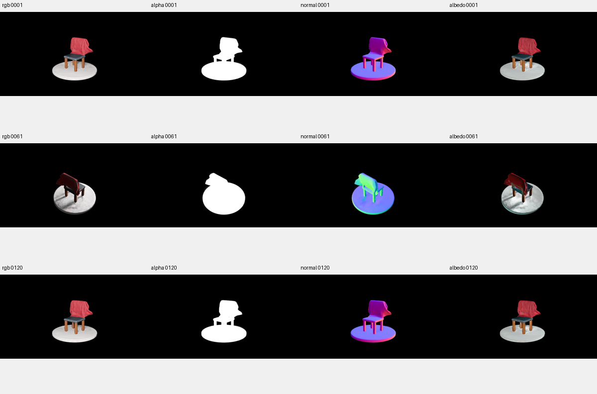
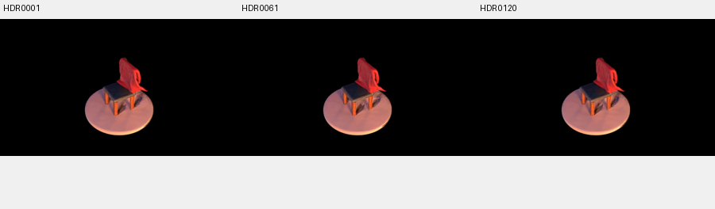
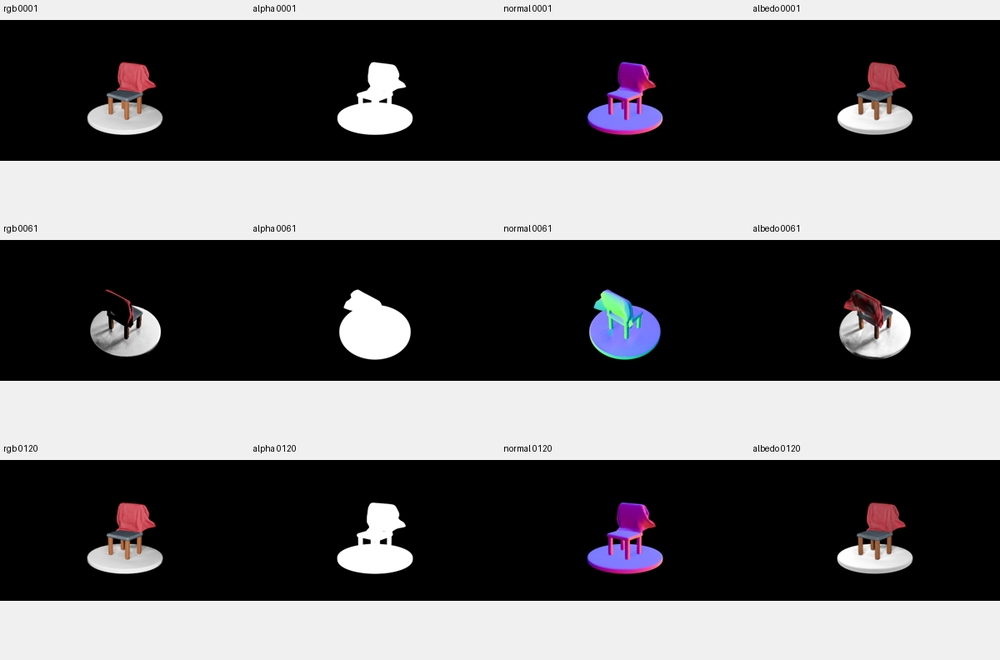
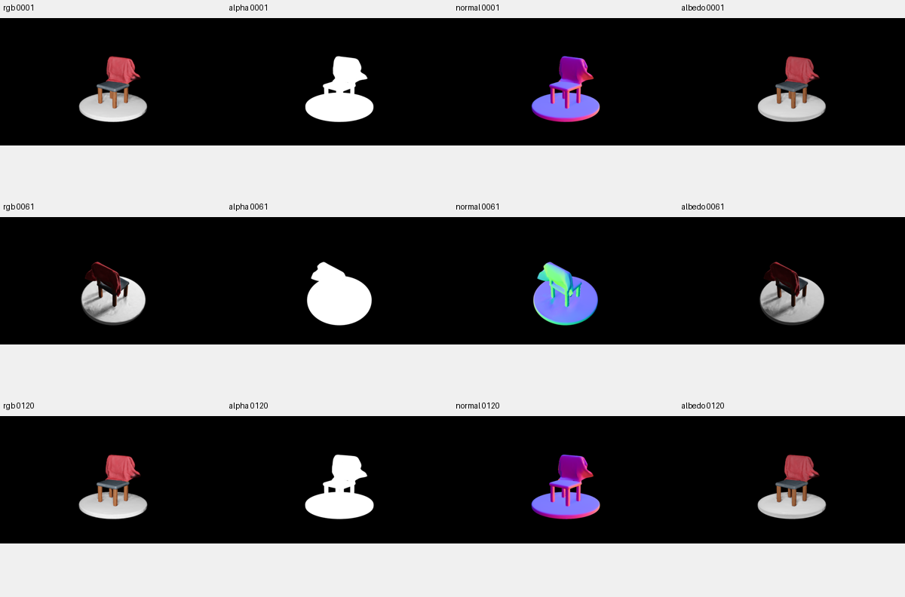
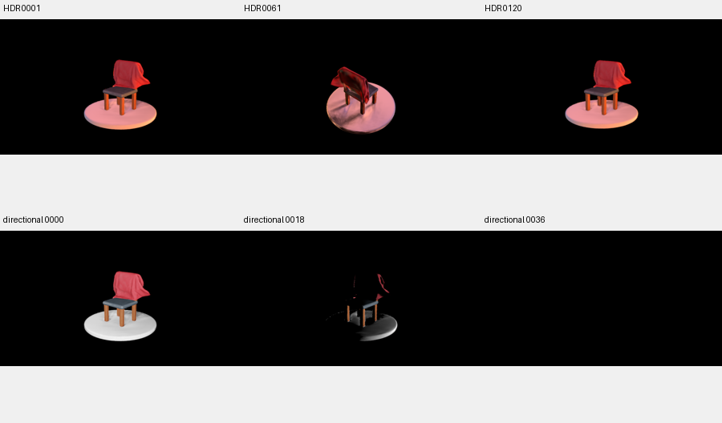

# Stage2 三管线对照验收与限制

日期：2026-10-02；实现分支：`1001-stage2-perlight`；venus / lumimotion。

## 结论与当前状态

Stage1 SH 算法保留原始代码，Stage2 新增固定 SH 几何的 `photometric_lambertian` 双方向光模式。原始IR、GT、learned 三组正式训练、评估与完整渲染均通过最终功能验收。原始HDR曾在配置读取阶段失败，修复后成功；两次失败日志和历史FAILED标记保留。通过功能验收不等于恢复真实材质或真实光照。

三组源自同一个SH iter35000，分辨率相同，最终累计iter55000。原始IR保留每4步更新与原来的材质、opacity、颜色形变头和环境光优化；新模式每步优化albedo，learned另优化105个训练时刻方向。因此本表比较同一来源和迭代区间下的管线结果，并非相同优化次数或计算预算。

## 同协议测试指标

15个测试帧均使用该帧实际相机和形变时间；learned灯光仅由训练方向插值。整图 PSNR 包含大面积黑背景，应同时看前景指标。前景 SSIM / LPIPS 使用遮罩后包围框，LPIPS使用VGG。

| 管线 | PSNR↑ | SSIM↑ | LPIPS↓ | 前景PSNR↑ | 前景bbox SSIM↑ | 前景bbox LPIPS↓ | 测试方向误差 | 状态 |
| --- | --- | --- | --- | --- | --- | --- | --- | --- |
| 原始IR | 34.53980 | 0.984867 | 0.019361 | 24.28745 | 0.905403 | 0.110585 | 不适用 | PASS |
| Lambertian GT | 29.92783 | 0.973209 | 0.025345 | 19.78163 | 0.828138 | 0.133389 | 0°（输入方向） | PASS |
| Lambertian learned | 32.24665 | 0.985234 | 0.017268 | 22.09130 | 0.908264 | 0.098603 | 60.04795° | PASS |

原始IR的整图/前景PSNR分别比learned高2.293/2.196dB；learned的SSIM与LPIPS略优。这是一个数据集与一组固定种子的结果，不支持全面替代原始PBR。learned在RGB上优于本次GT中心方向近似，但方向误差仍大。相机、时间和光照没有充分解耦，优化方向可以补偿模型与数据的差异，不能把更高PSNR解释为恢复了真实灯光。此处的GT是AREA灯位相对于固定场景中心的方向，不是面积光源的精确积分或位置光距离衰减模型。

## 实现、冻结和完整恢复证据

- `scripts/train_stage1.py`、`gaussian_renderer/__init__.py`、`scene/gaussian_model.py`、`gaussian_renderer/render_ir.py` 与原始9cd834f逐字节一致；仅补入必要相机/FOV/运行兼容修复。
- 120帧相机中心最大误差1.43e-6，FOV误差0；105训练/15测试无帧号重叠，源图均有真实RGBA。
- GT和learned初始/最终来源文件哈希及冻结指纹一致。GT只有albedo一个Adam参数组完成20,000步；learned的albedo/方向两个组分别20,000步。120帧alpha和normal两组逐像素一致，证明其变化来自颜色和光照分支。
- CPU17项数值检查通过，包括原始IR总损失及全部梯度逐位回归、平面明暗响应、插值与GT冻结、CLI权重优先、sRGB/linear、HDR白炉和原始HDR轴向。
- GT/learned各200步冒烟及独立恢复实验完成完整渲染。Python/NumPy/Torch/CUDA随机状态及相机队列一致；材质/方向/Adam数值等价。CUDA原子累加的albedo logit最大差异4.77e-7，记录容差为rtol=1e-5、atol=1e-6；恢复后测试指标差异均小于1e-5。
- 初次训练拒绝来源目录、来源子目录和非空已有实验；checkpoint与统一渲染拒绝覆盖。完整恢复依赖原始数据和只读SH来源，checkpoint不是独立于来源文件的模型包。

## 四类可视化与重光照

原始IR的RGB/alpha/normal首中尾同样正常，albedo背面与底盘存在阴影/偏色残留。旧HDR配置合并与deform_type默认值修复仅影响读取；训练checkpoint及原始渲染算法保留。旧HDR共120帧及1视频，加上四类视频共5段，已完整解码；它将640×360自动调整为640×368，沿用旧编码方式。

GT与learned的首帧0001、中帧0061、尾帧0120已目检。RGB可辨识红布料、椅子和底盘；中间背面较暗，GT存在近黑区域。alpha轮廓稳定，椅腿孔隙清楚；法线连续且由冻结GS几何产生。albedo正面材质可辨，但背面阴影纹理及底盘斑驳仍明显，尚未完全分离材质与成像光照。

共享文档保留代表审阅图，原始图像和视频仍以实验产物为准：

两组均有120帧RGB/alpha/normal/albedo及四段视频、72帧固定相机转灯与视频、120帧HDR与视频，总计每组六段视频。所有视频均逐帧解码验证帧数。转灯alpha完全相同、亮度随方向变化；背向光接近全黑符合没有环境补光的直接Lambertian。

HDR使用同一个GoldenBay、2048个确定性球面样本，世界Z向上、经度atan2(-y,x)与原始脚本一致。早期atan2(y,x)的镜像HDR与首次严格浮点检查失败日志完整保留，冒烟最终HDR另写新目录。正式结果直接使用修复轴向。HDR没有真值，当前仅验证功能和定性响应；原始IR的旧HDR脚本为固定首个测试视角、遍历时间，新模式为各帧自身视角，不能对两者HDR逐像素算公平误差。

## 产物与复现入口

完整实际训练/渲染命令、版本、日志、逐帧指标和代表媒体以各实验README为准。venus当前实现工作树为 `/home/lihan/reproduce/LumiMotion-stage2-perlight`，以下路径相对于该目录；其他分支只同步共享文档，output不会随Git同步。

- 原始IR：`output/1002-02-onlyclothV4-stage2_original/README.md`。
- GT：`output/1002-03-onlyclothV4-stage2_GT/README.md`。
- learned：`output/1002-04-onlyclothV4-stage2_learned/README.md`。
- 冒烟：`output/smoke_test/1002-02-onlyclothV4-stage2_GT/`、`1002-03-onlyclothV4-stage2_learned/`。
- 恢复：`output/smoke_test/1002-04-onlyclothV4-stage2_GT_resume/`、`1002-05-onlyclothV4-stage2_learned_resume/`。
- 来源/GPU数值检查：GT冒烟目录的 `source_preflight.json`、`gpu_checks_final.json` 与 `logs/unit_tests_17_verified.log`。
- 正式checkpoint与媒体检查：各实验 `inspection/checkpoint_checks.json`、`artifact_checks.json`、`manual_review.json`。

执行方式见 [Stage2使用指南](../指导/1002-01-Stage2-Lambertian训练渲染与续训使用说明.md)。三组均最终PASS，所有失败尝试保留。本次结果不能支持“Lambertian全面优于原始PBR”或“恢复了真实albedo”的结论。17项CPU检查、实际GPU冻结/恢复检查和三组完整媒体验收共同支持本次实现可用。
